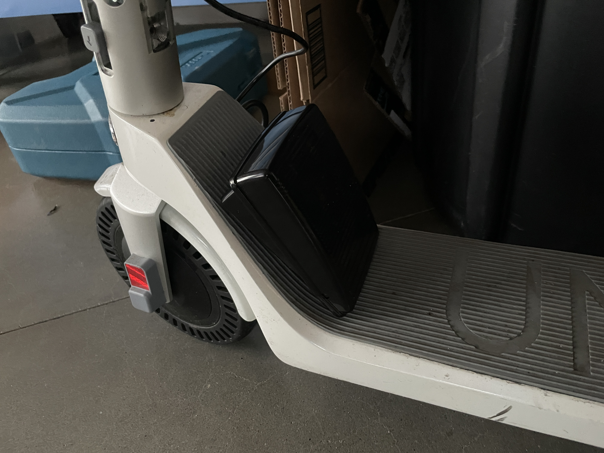
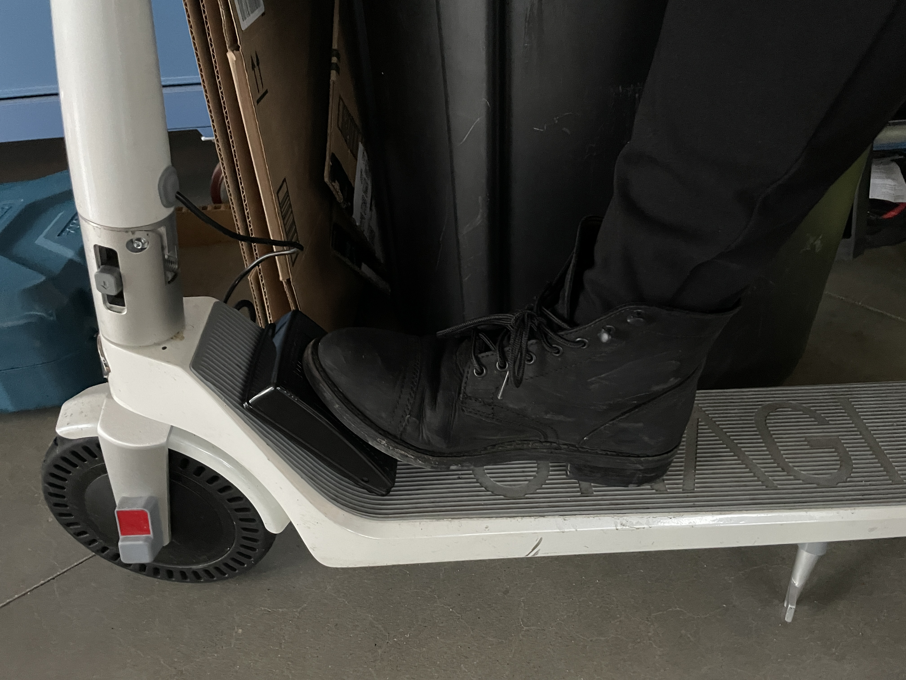
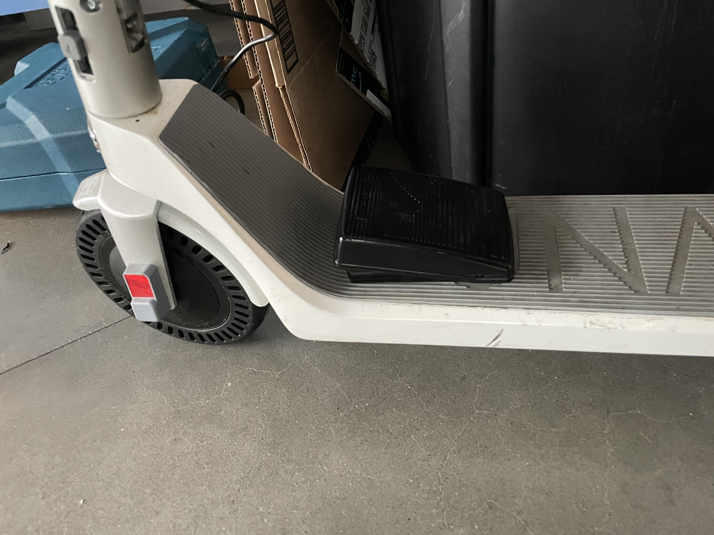
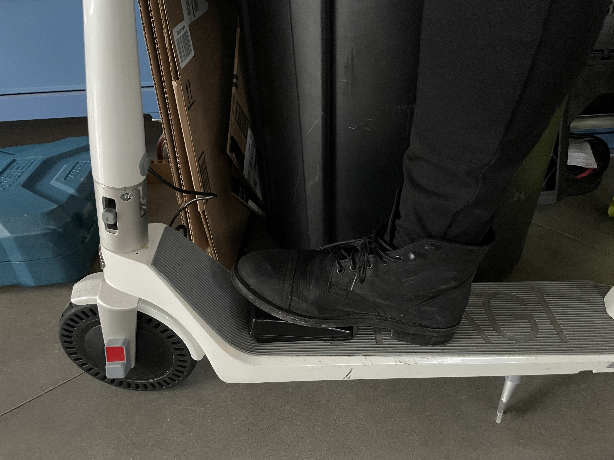
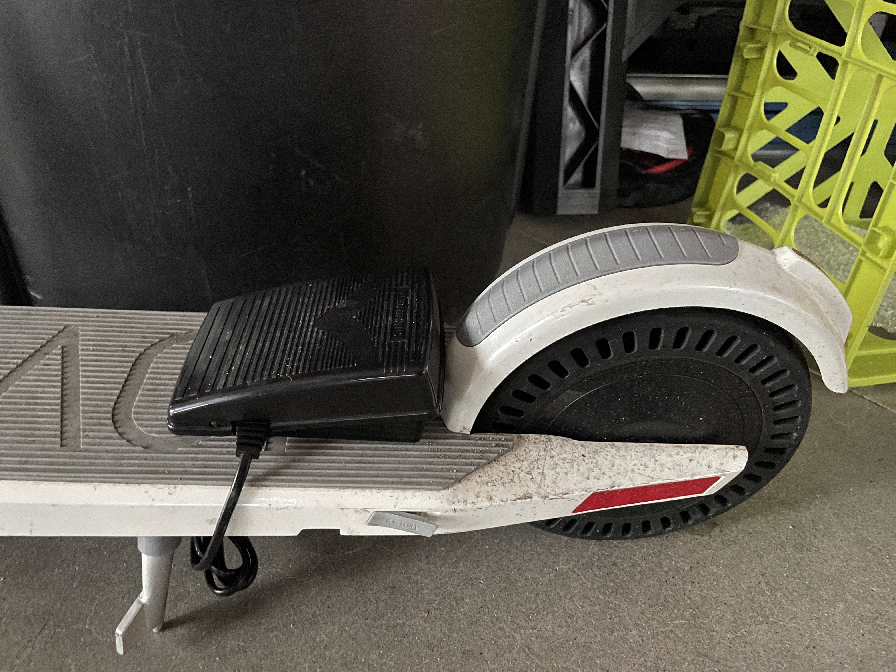
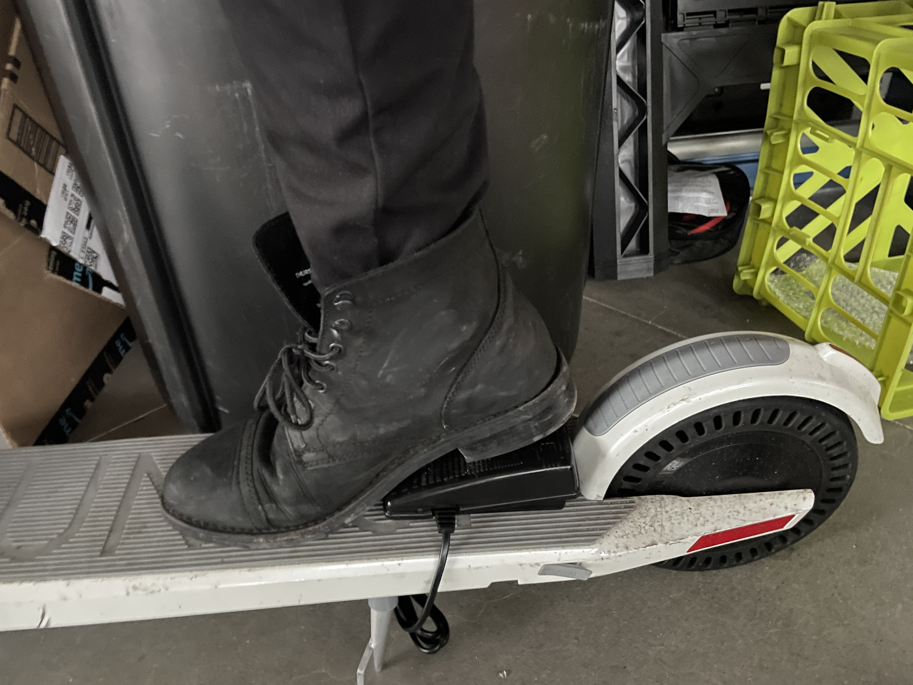
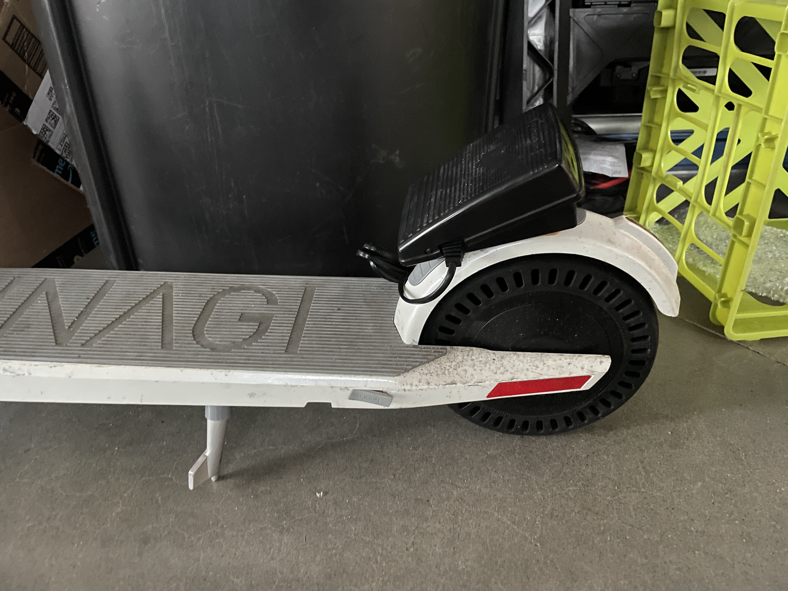
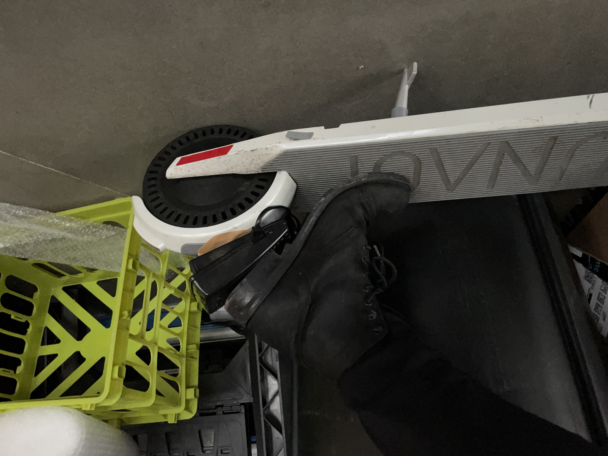

# "Foot Pedal" Prototype Documantation

## "Where"

| Prototype #1 |  |
|---------------|----------------|
|  |   |
| **Variable:** | places of the pedal  |
| **Difference from others:** | It's on the front area of the board and lean on the edge of the board |
| **Pros:** | You can kick the pedal  |
| **Cons:** | Need to high up your toe in order to click propery |
| **Comments:** | Not good. Because  |

| Prototype #2 |  |
|---------------|----------------|
|  |   |
| **Variable:** | places of the pedal  |
| **Difference from others:** | It's on the front area of the board  |
| **Pros:** | You can easily access to the pedal |
| **Cons:** | It's difficult not to push while not in use |
| **Comments:** | Good. Because  |

| Prototype #3 |  |
|---------------|----------------|
|  |   |
| **Variable:** | places of the pedal  |
| **Difference from others:** | It's on the rear area of the board  |
| **Pros:** | You can it with you heel |
| **Cons:** | it's difficult to use your heel to push the pedal by heel|
| **Comments:** | Not good. Because  |

| Prototype #4 |  |
|---------------|----------------|
|  |   |
| **Variable:** | places of the pedal  |
| **Difference from others:** | It's on the rear wheel cover  |
| **Pros:** | You can reach out the button without fully ungripping the bar, You can see it very easily |
| **Cons:** | You can't easily access the button |
| **Comments:** | Not good. Because you need to move your hand on the bar especially when you grip the eadg of the bar. |

## Number of push
