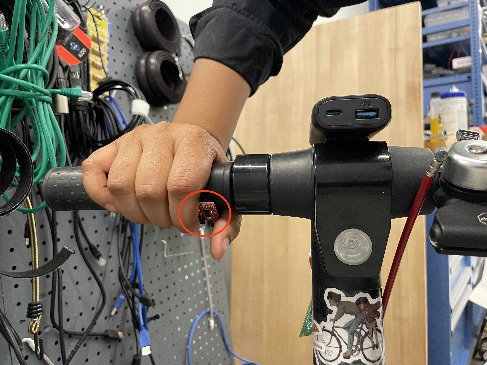
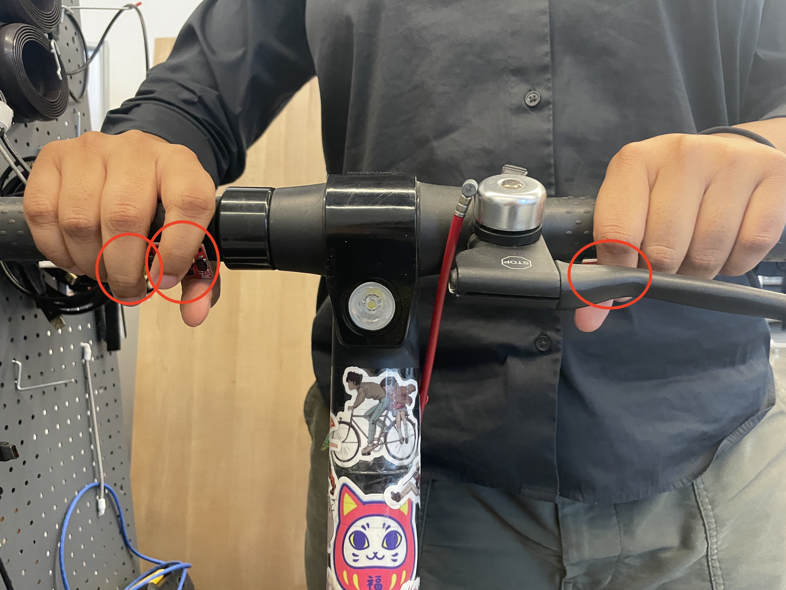
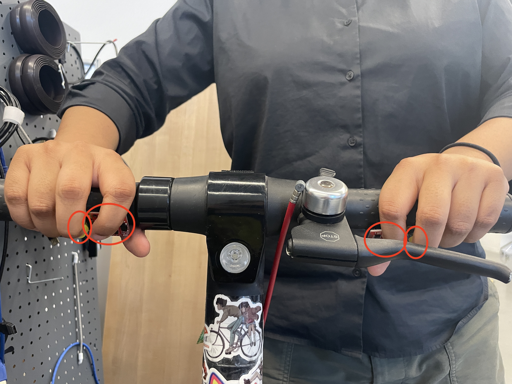

# "How many" Prototype Documantation

| Prototype #1 |  |
|---------------|----------------|
|  |   |
| **Variable:** | number of a button  
| **Difference from others:** | It only has a single button  |
| **Pros:** | You only use one finger to push the button |
| **Cons:** | You need to push the button in several different way to control differently |
| **Comments:** | Not good but Not bad. It's difficult to do an detailed controll. Also I felt like the pusshing the button by middle finger was much easier for me than useing point finger. |

| Prototype #2 |  |
|---------------|----------------|
|  |   |
| **Variable:** | number of a button  
| **Difference from others:** | It has two buttons  |
| **Pros:** | Intuitive when you do the same move with the both hands, you can use the button differently |
| **Cons:** | none |
| **Comments:** | Very good. Because it was intuitive to do the same movement with the both hands |

| Prototype #3 |  |
|---------------|----------------|
|  |   |
| **Variable:** | number of a button  |
| **Difference from others:** | It has three buttons  |
| **Pros:** | hmm... |
| **Cons:** | Need to remember which buttun is the button you want to push |
| **Comments:** | Not good. I didn't feel any reasone why I need three buttons |

| Prototype #4 |  |
|---------------|----------------|
|  |   |
| **Variable:** | number of a button  |
| **Difference from others:** | It has four buttons  |
| **Pros:** | Yor |
| **Cons:** | Yon |
| **Comments:** | Not good but Not bad. n |

