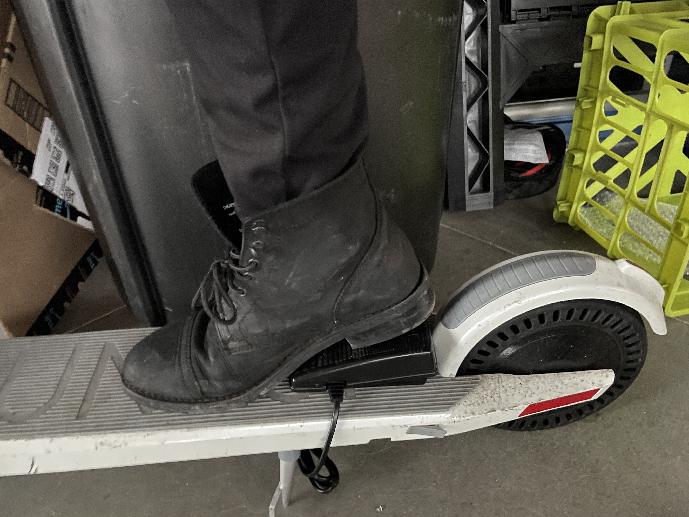

# "Throttle" Prototype Documantation

## "Where"

| Prototype #1 |  |
|---------------|----------------|
|  |   |
| **Variable:** | places of the throttle  |
| **Difference from others:** | It's in right handle bar |
| **Pros:** | low leraning curve because it's the same as motorcycle  |
| **Cons:** | Difficult to use accelarator at the same time |
| **Comments:** | Not good. Because it's really defficult to do driving task at the same time  |

| Prototype #2 |  |
|---------------|----------------|
|  |   |
| **Variable:** | places of the throttle  |
| **Difference from others:** | It's in left handle bar  |
| **Pros:** | You can easily access to the pedal |
| **Cons:** | most of people are not left handed |
| **Comments:** | Good. Because  |

| Prototype #3 |  |
|---------------|----------------|
|  |   |
| **Variable:** | places of the pedal  |
| **Difference from others:** | It's on the rear area of the board  |
| **Pros:** | You can it with you heel |
| **Cons:** | it's difficult to use your heel to push the pedal by heel|
| **Comments:** | Not good. Because  |

| Prototype #4 |  |
|---------------|----------------|
|  |   |
| **Variable:** | places of the pedal  |
| **Difference from others:** | It's on the rear wheel cover  |
| **Pros:** | You can reach out the button without fully ungripping the bar, You can see it very easily |
| **Cons:** | You can't easily access the button |
| **Comments:** | Not good. Because you need to move your hand on the bar especially when you grip the eadg of the bar. |

## Number of push
