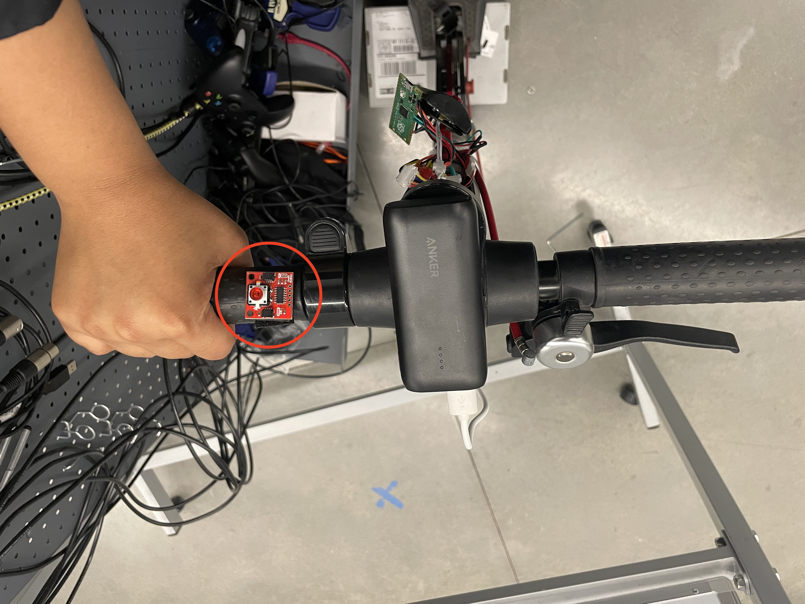
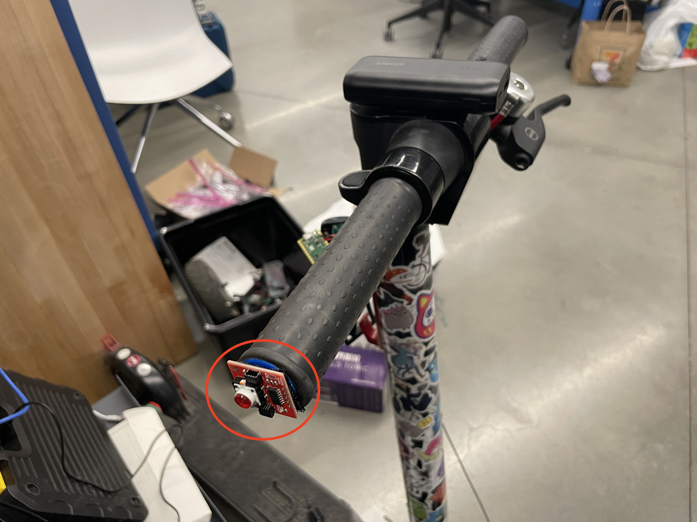

# "Where" Prototype Documantation

| Prototype #1 |  |
|---------------|----------------|
|  |   |
| **Variable:** | places of a button  
| **Difference from others:** | It's on the handle bar  |
| **Pros:** | You can reach out the button without ungripping the bar |
| **Cons:** | Need to move your hands to reach out the button |
| **Comments:** | Not good. Because you can't fully grip the bar when you push the button |

| Prototype #2 |  |
|---------------|----------------|
|  |   |
| **Variable:** | places of a button  |
| **Difference from others:** | It's underneath the handle bar  |
| **Pros:** | You can reach out the button without ungripping the bar |
| **Cons:** | You can't directly see the button |
| **Comments:** | Really good. Because you can access it with fully grip the bar, and you can focus on seeing strait when you press the button because you already know where to push |

| Prototype #3 |  |
|---------------|----------------|
|  |   |
| **Variable:** | places of a button  |
| **Difference from others:** | It's on the edge of the handle bar  |
| **Pros:** | You can reach out the button without ungripping the bar |
| **Cons:** | You can't directly see the button, You need to do either way to use pinky finger or to completery off the hand from the bar to use other fingers to push the button |
| **Comments:** | Not good. Because you lose fully grip while you push the button, and you need to look for the place to push since you can't see the button |

| Prototype #4 |  |
|---------------|----------------|
|  |   |
| **Variable:** | places of a button  |
| **Difference from others:** | It's on the center concole (in the middle of the handle bar)  |
| **Pros:** | You can reach out the button without fully ungripping the bar, You can see it very easily |
| **Cons:** | You can't easily access the button |
| **Comments:** | Not good. Because you need to move your hand on the bar especially when you grip the eadg of the bar. |

| Prototype #5 |  |
|---------------|----------------|
|  |   |
| **Variable:** | places of a button  |
| **Difference from others:** | It's on the edge of thecenter concole (closer to the handle bar)  |
| **Pros:** | You can reach out the button without fully ungripping the bar, You can see it very easily |
| **Cons:** | You can't easily access the button |
| **Comments:** | Not good. Because you need to move your hand on the bar especially when you grip the eadg of the bar. |

